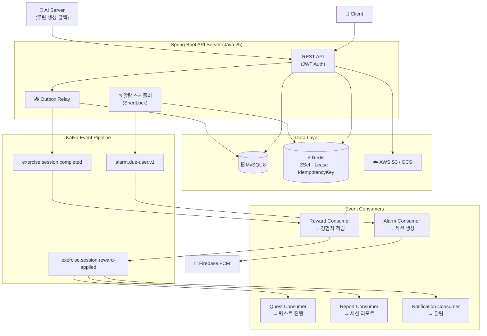

# 🏃 개발자 키우기 — Backend

> 앉아서 일하는 개발자를 위한 **AI 기반 맞춤 운동 루틴 앱**의 백엔드 서버

[](https://openjdk.org/)
[](https://spring.io/projects/spring-boot)
[](https://www.mysql.com/)
[](https://redis.io/)
[](https://kafka.apache.org/)
[](https://aws.amazon.com/)
[](https://www.docker.com/)

---

## 📌 프로젝트 소개

코딩에 집중하다 보면 운동 습관을 놓치기 쉽습니다. **개발자 키우기**는 이 문제를 해결하기 위해, 건강 설문을 기반으로 AI가 맞춤 운동 루틴을 생성하고 푸시 알림으로 잊지 않게 챙겨주는 서비스입니다.

| 기능 | 설명 |
|------|------|
| 🤖 AI 맞춤 루틴 | 건강 설문 기반으로 AI 서버가 개인화된 운동 루틴을 생성 |
| 🔔 푸시 알림 | 사용자 설정 주기·활동시간·방해금지 조건에 맞춰 정밀 알림 발송 |
| 🌱 운동 기록 시각화 | GitHub 잔디 형태로 매일의 운동 기록을 누적 확인 |
| 🎮 캐릭터 성장 시스템 | 운동할 때마다 캐릭터 경험치 적립, 퀘스트 달성으로 레벨업 |

> **팀 구성:** 백엔드 1인 · AI 2인 · 프론트엔드 2인 · 클라우드 1인  
> **기간:** 2025.01 ~ 2026.04 (3회 버전 반복 개발)

---

## 🛠 기술 스택 & 선정 근거

| 분류 | 기술 | 선정 근거 |
|------|------|-----------|
| **언어** | Java 25 | Virtual Thread pinning 이슈 해소 버전 — I/O 집약적인 푸시 발송 처리량 향상 |
| **프레임워크** | Spring Boot 3.5.9 | Virtual Thread 모니터링 지원(Actuator 3.5+) + 성숙한 운영 레퍼런스 |
| **DB** | MySQL 8 + Spring Data JPA | InnoDB `FOR UPDATE SKIP LOCKED`로 배치 경합 최소화, 안정적인 트랜잭션 지원 |
| **캐시 (로컬)** | Caffeine | 정적 데이터(운동 목록)에 네트워크 비용 없는 로컬 캐시, Window TinyLFU eviction |
| **캐시 (분산)** | Redis | Sorted Set으로 스케줄러 우선순위 큐, 원자적 연산으로 멀티 인스턴스 공유 상태 관리 |
| **메시징** | Apache Kafka | 이벤트 리플레이·멀티 컨슈머 그룹 독립 소비 — SQS 대비 팬아웃 구조에 적합 |
| **이벤트 일관성** | Outbox Pattern | 분산 트랜잭션(2PC) 없이 Kafka 이벤트 유실 방지, DB 트랜잭션과 원자 처리 |
| **분산 스케줄링** | ShedLock + Redis | 멀티 인스턴스에서 단일 실행 보장, 스케줄러 중복 처리 방지 |
| **푸시** | Firebase FCM | `sendAsync` + 동시성 제한으로 I/O 블로킹 없이 대량 발송 |
| **스토리지** | AWS S3 / Google Cloud Storage | 멀티 클라우드 추상화 — GCP 무료 기간 → AWS 마이그레이션 유연 대응 |
| **인프라** | AWS EC2 + ECR + CodeDeploy | Blue-Green 자동 롤백 배포 파이프라인 |
| **모니터링** | OpenTelemetry + Prometheus + Tempo | 분산 트레이싱 + 메트릭 수집 + 가시화 |

---

## 🏗 시스템 아키텍처



---

## ⚡ 핵심 기술 도전 과제

### 🔔 도전 1 — 10,000명 규모 분산 알람 스케줄러

#### 상황 (Situation)

사용자마다 **알람 간격·활동 시간·방해금지(DND)·반복 요일**이 모두 달라 단순 Cron으로는 분 단위 정밀 발송이 불가능했습니다. 또한 서비스 가용성을 위해 멀티 인스턴스 배포가 필요했는데, 이 환경에서 같은 사용자에게 중복 알람이 발송되는 문제가 있었습니다.

#### 한계 측정

먼저 단일 스케줄러의 처리 한계를 **10,000명 대상 부하 테스트**로 측정했습니다.

| 처리 단계 | 소요 시간 |
|-----------|-----------|
| Redis ZSet 조회 | 73ms (0.1%) |
| AlarmSettings 필터링 | 522ms (0.7%) |
| 세션 생성 (DB) | **38,116ms (51.1%)** |
| 푸시 발송 (FCM) | **35,810ms (48.0%)** |
| **합계** | **74,528ms (약 74.5초)** |

> 1분 스케줄 윈도우를 초과 → 처리 지연이 누적되고 사용자에게 알람이 늦게 도달

또한 DB 쿼리 21,008건 / 엔티티 로드 102,003건이 발생하여 단순 확장이 불가능함을 확인했습니다.

#### 해결 방안 (Action)

**① Redis Sorted Set 기반 스케줄 저장소**

`nextFireAt`을 score로 하는 ZSet으로 O(log n) 조회. DB 폴링 없이 due user를 빠르게 선별합니다.

```
due_alarm_schedules     (ZSet: score = nextFireAt epoch millis)
processing_alarm_schedules  (ZSet: score = leaseExpireAt)  ← Lease
```

**② Lease 메커니즘으로 중복 처리 방지**

due user를 claim할 때 `processing` ZSet으로 원자 이동(Lease 부여). 처리 완료 전 인스턴스가 죽으면 만료된 Lease를 자동으로 due ZSet에 복귀시켜 자동 복구합니다.

**③ Kafka + Outbox로 세션 생성 분리**

`alarm.due-user.v1` 이벤트를 Outbox를 통해 발행 → Alarm Consumer가 독립적으로 세션을 생성하고 FCM 발송. 스케줄러의 책임 범위를 "due user 선별"로 한정합니다.

**④ DB 배치 최적화**

`FOR UPDATE SKIP LOCKED` + 배치 상태 전환으로 경합 최소화. Firebase `sendAsync` + 인플라이트 제한으로 I/O 블로킹 제거.

#### 결과 (Result)

| 지표 | 개선 전 | 개선 후 |
|------|---------|---------|
| 10,000명 처리 시간 | 74.5초 (윈도우 초과) | — |
| 처리량 (2 인스턴스) | — | **400 ops** |
| 스케줄 지연 | 누적 지연 발생 | **1초 이내** |
| 장애 복구 | 수동 처리 필요 | Lease 만료 → 자동 재처리 |

---

### 🤖 도전 2 — AI 루틴 생성 비동기 파이프라인

#### 상황 (Situation)

건강 설문 제출 후 AI 서버로 루틴 생성을 **동기 요청**하면 두 가지 문제가 발생했습니다.

1. AI 서버의 임베딩 연산 시간이 가변적 → 응답 대기 시간 예측 불가
2. AI 서버 장애 시 설문 트랜잭션 전체 롤백 → 사용자가 재설문 필요

#### 해결 방안 (Action)

**① Outbox Pattern으로 설문 저장과 AI 요청 분리**

```
[설문 API] ─ 하나의 트랜잭션 ─┬─▶ survey_submissions 저장
                               └─▶ outbox_events 저장 (PENDING)
                                        ↓ (Outbox Relay 폴링)
                              [Kafka: ai-routine-request.v1]
                                        ↓
                              [AI Server] ─콜백─▶ [Callback API]
```

**② Job 상태 머신으로 진행 상태 추적**

```
PENDING → REQUESTED → COMPLETED
                    ↘ FAILED (재시도 가능)
```

**③ 기존 루틴 보호 로직**

AI 응답 검증 후 교체. 검증 실패 시 기존 루틴은 유지되고 Job만 FAILED 처리.

**④ Rate Limit (429) 처리**

동일 사용자의 중복 설문 요청 시 429로 차단하여 AI 서버 과부하 방지.

#### 결과 (Result)

- 설문 API 응답 시간이 AI 서버 처리 시간과 **완전히 독립**
- AI 서버 장애 시에도 설문 데이터 손실 없음, Outbox를 통해 **재처리 가능**
- 루틴 생성 상태를 클라이언트가 폴링으로 확인 가능 (낙관적 UI 처리 지원)

---

### 🏋️ 도전 3 — 이벤트 드리븐 세션 완료 멀티 파이프라인

#### 상황 (Situation)

운동 세션이 완료되면 **4개 도메인**이 독립적으로 처리되어야 합니다.

- 캐릭터 경험치·스트릭 적립 (Reward)
- 퀘스트 진행 업데이트 (Quest)
- 세션 리포트 생성 (Report)
- 완료 알림 발송 (Notification)

동기로 순차 처리하면 하나의 실패가 전체 롤백을 일으키고, API 응답이 모든 처리가 끝날 때까지 블로킹됩니다.

#### 해결 방안 (Action)

**2-Stage Kafka 팬아웃 파이프라인**

```
세션 완료 API
    │
    ▼ (Outbox)
exercise.session.completed
    │
    ▼
[Reward Consumer] ─ 경험치/스트릭 적립 후 ──▶ exercise.session.reward-applied
                                                        │
                              ┌─────────────────────────┼──────────────────────┐
                              ▼                         ▼                      ▼
                   [Quest Consumer]          [Report Consumer]      [Notification Consumer]
```

**컨슈머 멱등성 보장**

`(consumerName, eventId)` 조합으로 중복 처리 방지. Kafka 재처리나 네트워크 재시도 시에도 안전합니다.

**도메인 레벨 가드**

- Quest: 동일 날짜 중복 진행 방지, 연속일 스트릭 계산 (Asia/Seoul 기준)
- Report: 동일 sessionId 중복 생성 방지
- Reward: firstCompletionToday 플래그로 스트릭 증가 정확성 보장

#### 결과 (Result)

- 세션 완료 API 응답이 downstream 처리 시간에서 **완전히 분리**
- 4개 도메인 **독립 스케일링** 및 **장애 격리** — Quest 컨슈머 장애가 Report 처리에 영향 없음
- 이벤트 기반 설계로 신규 도메인 추가 시 기존 코드 변경 없이 **컨슈머만 추가**

---

## 🚀 CI/CD & 인프라

```
코드 Push (main/develop)
    │
    ▼
[GitHub Actions]
    ├─ Gradle 빌드 & 테스트
    ├─ Docker 이미지 빌드
    └─ AWS ECR Push
            │
            ▼
    [AWS CodeDeploy]
            │
            ▼
    [EC2 Blue-Green 배포]
    ├─ Docker Compose 실행
    ├─ 헬스체크 (GET /api/actuator/health, 최대 120초)
    └─ 실패 시 자동 롤백
```

**환경 구성**

| 환경 | 설명 |
|------|------|
| `local` | 로컬 개발 환경 |
| `dev` | 개발 서버 (GCP → AWS 마이그레이션) |
| `prod` | 프로덕션 서버 (AWS EC2) |

**모니터링 스택**

- **OpenTelemetry Java Agent** — 코드 변경 없는 분산 트레이싱 자동 수집
- **Prometheus** — 메트릭 수집 (Virtual Thread 지표 포함)
- **Grafana Tempo** — 트레이스 시각화 및 병목 분석

---

## 📚 기술 의사결정 문서

상세한 기술 검토 및 트레이드오프 분석 문서는 아래에서 확인할 수 있습니다.

| 문서 | 내용 |
|------|------|
| [알람 스케줄링 테크 스펙](./docs/alarm-scheduling-tech-spec.md) | Redis ZSet 스케줄러 설계, Lease 메커니즘, 대안 비교 |
| [AI 루틴 생성 테크 스펙](./docs/ai-routine-generation-job-tech-spec.md) | 비동기 Job 파이프라인 설계, 콜백 패턴 |
| [세션 완료 파이프라인 테크 스펙](./docs/exercise-session-completion-pipeline-tech-spec.md) | 2-Stage Kafka 팬아웃, 멱등성 설계 |
| [기술 스택 선정 (Notion)](https://www.notion.so/2e7577ab4aae804491b1d04ce89e4c4c) | 언어·프레임워크·DB·캐시·메시징 트레이드오프 전체 기록 |
| [스케줄러 성능 측정 (Notion)](https://www.notion.so/319577ab4aae804c98c1e459ae39dfb0) | 10,000명 규모 부하 테스트 상세 데이터 |
