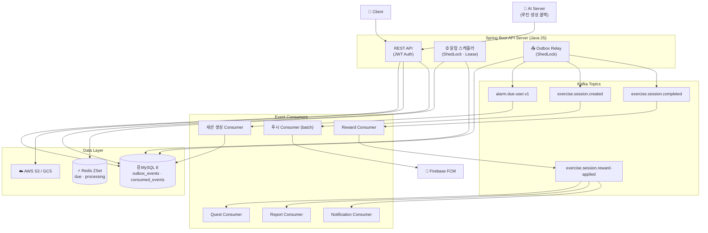

# 🏃 개발자 키우기 — Backend

> 앉아서 일하는 개발자를 위한 **AI 기반 맞춤 운동 루틴 앱**의 백엔드 서버

[](https://openjdk.org/)
[](https://spring.io/projects/spring-boot)
[](https://www.mysql.com/)
[](https://redis.io/)
[](https://kafka.apache.org/)
[](https://aws.amazon.com/)
[](https://www.docker.com/)

---

## 📌 프로젝트 소개

코딩에 집중하다 보면 운동 습관을 놓치기 쉽습니다. **개발자 키우기**는 건강 설문을 기반으로 AI가 맞춤 운동 루틴을 생성하고, 사용자가 정한 시각에 푸시 알림으로 챙겨주는 서비스입니다.

| 기능 | 설명 |
|------|------|
| 🤖 AI 맞춤 루틴 | 건강 설문 기반으로 AI 서버가 개인화된 운동 루틴을 생성 |
| 🔔 푸시 알림 | 사용자 설정 주기·활동시간·방해금지 조건에 맞춰 정밀 알림 발송 |
| 🌱 운동 기록 시각화 | GitHub 잔디 형태로 매일의 운동 기록을 누적 확인 |
| 🎮 캐릭터 성장 시스템 | 운동할 때마다 캐릭터 경험치 적립, 퀘스트 달성으로 레벨업 |

> **팀 구성:** 백엔드 1인 · AI 2인 · 프론트엔드 2인 · 클라우드 1인
> **기간:** 2025.01 ~ 2026.04 (3회 버전 반복 개발)

---

## 🛠 기술 스택 & 선정 근거

| 분류 | 기술 | 선정 근거 |
|------|------|-----------|
| **언어** | Java 25 | Virtual Thread pinning 이슈 해소 버전 — I/O 집약적인 푸시 발송 처리량 향상 |
| **프레임워크** | Spring Boot 3.5.9 | Virtual Thread 모니터링 지원(Actuator 3.5+) + 성숙한 운영 레퍼런스 |
| **DB** | MySQL 8 + Spring Data JPA | InnoDB `FOR UPDATE SKIP LOCKED`로 배치 경합 최소화, 안정적인 트랜잭션 지원 |
| **캐시 (로컬)** | Caffeine | 정적 데이터(운동 목록)에 네트워크 비용 없는 로컬 캐시, Window TinyLFU eviction |
| **스케줄 저장소** | Redis Sorted Set | 다음 발송 시각을 score로 둬 **대상자만 정렬된 상태로 조회**. 리스(lease) 기반 claim에 원자 연산 활용 |
| **메시징** | Apache Kafka | 하나의 이벤트를 **여러 컨슈머 그룹이 독립 소비**(팬아웃) — 세션 완료 후속 처리에 적합 |
| **이벤트 일관성** | Outbox Pattern | 분산 트랜잭션 없이 DB 상태 변경과 이벤트 발행을 원자적으로 묶음 |
| **분산 스케줄링** | ShedLock + Redis | 멀티 인스턴스에서 스케줄러 단일 실행 보장 |
| **푸시** | Firebase FCM | `sendAsync` + 인플라이트 제한으로 I/O 블로킹 없이 대량 발송 |
| **스토리지** | AWS S3 / Google Cloud Storage | 멀티 클라우드 추상화 — GCP 무료 기간 → AWS 마이그레이션 유연 대응 |
| **인프라** | AWS EC2 + ECR + CodeDeploy | Blue-Green 자동 롤백 배포 파이프라인 |
| **모니터링** | OpenTelemetry + Prometheus + Tempo | 분산 트레이싱 + 메트릭 수집 + 가시화 |

---

## 🏗 시스템 아키텍처



> **읽는 법** — 애플리케이션은 Kafka에 직접 발행하지 않습니다. 모든 이벤트는 `outbox_events`에 먼저 기록되고, **별도의 릴레이 스케줄러**가 그것을 읽어 발행합니다.
> 알람 하나는 이 경로를 **두 번** 통과합니다 — `alarm.due-user.v1`로 한 번, 세션 생성 후 `exercise.session.created`로 한 번.

---

## ⚡ 핵심 기술 도전 과제

### 🔔 도전 1 — 1만 명에게 1분 안에

#### 상황

사용자마다 **알람 간격·활동 시간·집중 시간(방해금지)·반복 요일**이 모두 달라 단순 Cron으로는 분 단위 정밀 발송이 불가능했습니다. 가용성을 위해 멀티 인스턴스가 필요했지만, 그 환경에서는 같은 사용자에게 중복 알람이 갈 수 있었습니다.

**SLO를 하나로 못박고 시작했습니다** — *특정 시점에 대상자 1만 명이 생겨도 1분 이내 발송 완료.*

#### 측정할 수 있게 만들고 시작

스케줄러가 **단계별 소요·비중·쿼리 수·엔티티 로드 수**를 직접 로그로 남기게 했습니다. 이후 모든 판단이 이 로그 위에서 이뤄졌습니다.

첫 측정은 **1,000명 기준 373초**였고, 그중 **푸시가 98.7%**를 차지했습니다. FCM에 하나씩 보내고 응답을 기다리는 구조였습니다.

#### 개선 경로

한 번에 해결되지 않았습니다. 다섯 번에 걸쳐 뜯었고, **그중 한 번은 되돌렸습니다.**

| # | 무엇을 | 결과 |
|---|--------|------|
| 1 | `@Async` 비동기 발송 | 겉보기 373초 → 1.7초, **그러나 801건 중 681건이 거부되고 있었음** |
| 2 | DB 레벨 필터링 + N+1 제거 | 쿼리·엔티티 로드 감소, 총 소요는 그대로 |
| 3 | 트랜잭션 경계 분리 | 로그인에서는 **실패**, 푸시에서는 성공 — 커넥션 점유 **13.9ms → 1.9ms** |
| 4 | Redis ZSet 스케줄 저장소 | 대상자 조회 **1,391ms → 45ms** |
| 5 | Kafka 기반 이벤트 전환 | 발송 완료 **10분+ → 2분 20초** |

<details>
<summary><b>1. 비동기로 바꾸니 빨라졌다 — 줄 알았다</b></summary>

<br>

`@Async`를 붙이자 푸시 단계가 **368초 → 2ms**가 됐습니다. 여기서 멈췄다면 거짓 성과였습니다.

`CompletableFuture`로 **실제 처리 결과를 세어봤습니다.**

```
[Step 4] 푸시 전송: 시도=801건, 성공=120건, 실패=681건, 소요시간: 5086ms
```

빨라진 게 아니라 **기다리지 않았을 뿐**이었고, 정확히 `MaxPoolSize + QueueSize`만큼만 받은 뒤 나머지는 pool exhaustion으로 거부되고 있었습니다.

여기서 ExecutorPool 기반 처리의 구조적 한계를 정리했습니다.

- 사용자가 늘 때마다 **풀·큐 크기를 수동으로 조정**해야 함
- 큐를 키우면 메모리 증가 → GC 부하, 알림 즉시성 상실
- 장애가 즉시 드러나지 않고 **내부에 누적**되어 뒤늦게 확산
- **백프레셔가 동작하지 않아** 상위 계층에서 트래픽 제어 불가

결론은 *"메시징 큐 기반 구조가 답이지만, 현 규모에서는 도입 비용이 더 크다"*였습니다. 큐 크기를 100으로 제한해 메모리 폭증만 막아두고, **전환 시점을 미뤘습니다.** 실제 전환은 약 한 달 뒤에 했습니다.

</details>

<details>
<summary><b>2. 쿼리 최적화 — 점심시간에 90%가 버려지고 있었다</b></summary>

<br>

서비스 특성상 점심시간(12~13시)에는 **집중 시간으로 설정해 알림을 받지 않는 사용자 비율이 매우 높습니다.** 그런데 스케줄러는 거의 전체 사용자를 메모리로 올린 뒤 필터링하고 있었습니다.

DB 레벨에서 활동 시간·집중 시간·방해금지·반복 요일을 모두 걸러 **필요한 사용자만 조회**하도록 바꿨습니다.

```java
@Query("SELECT uas FROM UserAlarmSettings uas "
    + "JOIN FETCH uas.user u "
    + "WHERE uas.activeStartAt <= :currentTime AND uas.activeEndAt >= :currentTime "
    + "AND uas.repeatDays LIKE CONCAT('%', :currentDay, '%') "
    + "AND (uas.focusStartAt IS NULL OR uas.focusEndAt IS NULL OR NOT ( … )) "
    + "AND (uas.dnd = false OR uas.dndFinishedAt IS NULL OR uas.dndFinishedAt <= :now)")
```

또한 사용자별 최근 세션을 반복 조회하며 발생하던 N+1을, id 목록 기준 **배치 조회 + Projection**으로 해소했습니다.

</details>

<details>
<summary><b>3. 트랜잭션 경계 — 같은 처방을 두 곳에 썼고 한 곳은 실패했다</b></summary>

<br>

부하 시험에서 `HikariCP Pending 188`이 관측됐습니다. **CPU는 50%로 여유로웠고**, 스레드들은 일을 못 한 채 커넥션을 기다리고 있었습니다(`TIMED_WAITING`).

일반적인 해법인 풀 크기 증설 대신, **커넥션 점유 시간 자체**를 줄이기로 했습니다.

**시도 1 — 로그인 (실패)**

로그인 222ms 중 조회 62ms + 암호 검증(BCrypt) 86ms가 트랜잭션 안에 있었습니다. **절반 이상이 커넥션을 쥔 채 DB와 무관한 일을 하고 있었습니다.** 이 구간을 트랜잭션 밖으로 뺐습니다.

| | 분리 전 | 분리 후 |
|---|---|---|
| p95 | 8.56s | **60s** |
| 실패율 | 0.12% | **29.77%** |

**오히려 무너졌습니다.** 커넥션을 반환했다가 다시 얻는 비용이 붙었고, 고 RPS 상황에서는 재획득 경쟁이 더 심해졌기 때문입니다.

> 커넥션을 짧게 쓰는 것 **자체가** 이득은 아니다.

**시도 2 — 푸시 전송 (성공)**

적용 조건을 다시 정의했습니다 — **트랜잭션 중간에 "길고 DB와 무관한 대기"가 끼어 있는 곳**에만 쓴다. 푸시 전송이 정확히 그랬습니다. FCM 응답을 기다리는 내내 커넥션을 쥐고 있었으니까요.

DB 쓰기만 별도 빈(`FcmTokenTxService`)으로 분리해 그쪽에만 트랜잭션을 남겼습니다. *(같은 클래스 안에서 메서드만 나누면 프록시를 거치지 않아 트랜잭션이 생기지 않습니다.)*

| Connection Timing | 분리 전 | 분리 후 |
|---|---|---|
| 평균 | 13.9ms | **1.9ms** |
| 최대 | 25.8ms | **1.9ms** |

**약 85% 감소.** 다만 스케줄러 **전체 소요는 2,551ms → 2,543ms로 거의 변하지 않았습니다.** 국소 최적화로는 넘을 수 없는 벽이 있다는 신호였습니다.

</details>

<details>
<summary><b>4. Redis ZSet — 조건 검색에서 시간 인덱스로</b></summary>

<br>

매 1분마다 전체 레코드에 조건문 쿼리를 돌리는 구조는 사용자가 늘수록 선형으로 무거워집니다. **다음 발송 시각을 미리 계산해두면** 조건 검색 자체가 사라집니다.

```
alarm:next_fire_at        (ZSet)  member = userId, score = nextFireAt
alarm:processing_fire_at  (ZSet)  member = userId, score = leaseExpireAt
```

Redis에는 **userId만** 들어갑니다. 알람 설정·루틴·사용자 정보는 MySQL에서 조회하고, ZSet은 **"누가 언제인지"를 정렬해두는 시간 인덱스**로만 씁니다. 정합성의 원본은 MySQL의 `nextFireAt`이라 유실 시 부트스트랩으로 재구성됩니다.

`nextFireAt` 계산은 간격 → 방해금지 → 반복 요일(최대 7일 탐색) → 활동 시간 창 보정 → 집중 시간 회피 순으로 이뤄지며, **보낼 수 없는 사용자는 `null`이 되어 ZSet에서 제거**됩니다. 조회 대상이 자동으로 줄어듭니다.

| 지표 | 이전 | 이후 |
|---|---|---|
| 대상자 조회(Step 1) | 1,391ms | **45ms** |
| DB 쿼리 수 | 2,399 | 1,260 |
| 엔티티 로드 수 | 13,020 | 7,020 |
| GC Young time | 581ms | 258ms |

> 총 소요 기준 비교는 처리 대상 수가 달라진 구간이 섞여 있어, **조회 단계(97% 감소)를 순수 개선분으로 봅니다.**

</details>

<details>
<summary><b>5. Kafka 전환 — 늘리기 전에 얼마나 필요한지 계산했다</b></summary>

<br>

여기까지 개선한 뒤 대상자를 **1만 명으로 올려 다시 측정**했습니다.

| 단계 | 소요 | 비중 |
|---|---|---|
| Redis 조회 | 73ms | 0.1% |
| 설정 필터 | 522ms | 0.7% |
| **세션 생성** | **38,116ms** | **51.1%** |
| **푸시 발송** | **35,810ms** | **48.0%** |
| 합계 | **74,528ms** | 1분 창 초과 |

같은 로그에 **총 쿼리 21,008 · 엔티티 로드 102,003**이 찍혔습니다. 병목이 하나가 아니라 **둘로 갈려 있었고**, 스케줄러가 네 단계를 전부 직접 처리하는 구조 자체가 한계였습니다.

**필요한 처리량을 먼저 계산했습니다.** 메시지 하나당 P95 500ms · P99 1s를 재고 역산하면 —

> 1분에 1만 건 → 초당 170건 → **컨슈머 85개 필요**

이 숫자가 현실적이지 않다는 근거가 있었기에, **컨슈머를 무작정 늘리기 전에 로직 최적화를 먼저** 택했습니다. 조회 배치화, 트랜잭션 경합 축소, `sendAsync` 전환을 거친 뒤 구조를 바꿨습니다.

**① Redis 리스로 claim**

due ZSet에서 꺼내 processing ZSet으로 옮기는 것을 **Lua 스크립트 한 번**으로 처리합니다. 인스턴스가 처리 도중 죽어도 리스(5분)가 만료되면 자동으로 due로 복귀합니다.

**② Outbox로 발행 신뢰성 확보**

세션 생성과 **같은 트랜잭션**에 이벤트를 기록하고, 발행은 별도 릴레이가 책임집니다. 릴레이는 `PENDING`을 배치로 집어 `PROCESSING`으로 선점한 뒤 발행하고, 성공은 `PUBLISHED`·실패는 `PENDING` 복귀로 처리합니다.

**③ 컨슈머 분리**

세션 생성과 푸시 발송을 **독립 컨슈머**로 나눴습니다. 앞은 DB 바운드, 뒤는 외부 I/O 바운드로 병목이 달라 각각 확장할 수 있습니다. 푸시 컨슈머는 배치 리스너로 묶고 **인플라이트 수를 제한**했습니다.

중복 방지는 세 겹입니다 — `(consumerName, eventId)` 처리 이력, `(userId, scheduledAt)` 기준 세션 재사용, 제약 위반 시 재조회.

**④ 스케줄러 자기 보호**

배치 500건, 한 회 최대 20,000건, **실행 시간 예산 50초**에서 스스로 멈춥니다. 남은 대상자는 리스가 살아 있어 다음 주기가 안전하게 이어받습니다.

</details>

#### 결과

지표를 두 축으로 나눠서 봅니다. **스케줄러 실행 시간**과 **파이프라인 완료 시간**은 다른 지표입니다.

| 지표 | 이전 | 이후 |
|------|------|------|
| 스케줄러 실행 시간 (1만 명) | 74.5초 (창 초과) | **10초 이내** |
| 발송 완료 시간 (1만 명) | 10분 이상 | **2분 20초** |
| 대상자 조회 | 1,391ms | **45ms** |
| 커넥션 점유 시간 | 평균 13.9ms | **평균 1.9ms** |
| 인스턴스 장애 시 | 유실 | **리스 만료 → 자동 재처리** |

**SLO(1분)는 달성하지 못했습니다.** 파티션·컨슈머 확장, 비동기 전환, 아웃박스 배치 크기 조정(100 → 400)을 거쳐 7분 → 5분 → 3분 30초 → 2분 20초까지 줄였지만 목표에는 닿지 못했습니다. 계산상 필요한 컨슈머 85개는 당시 인프라에서 감당할 수 있는 규모가 아니었습니다.

---

### 🤖 도전 2 — AI 루틴 생성 비동기 파이프라인

#### 상황

건강 설문 제출 후 AI 서버로 루틴 생성을 **동기 요청**하면 두 가지 문제가 발생했습니다.

1. AI 서버의 임베딩 연산 시간이 가변적 → 응답 대기 시간 예측 불가
2. AI 서버 장애 시 설문 트랜잭션 전체 롤백 → 사용자가 재설문 필요

#### 해결

**① Outbox로 설문 저장과 AI 요청 분리**

```
[설문 API] ─ 하나의 트랜잭션 ─┬─▶ survey_submissions 저장
                               └─▶ outbox_events 저장 (PENDING)
                                        ↓ (Outbox Relay 폴링)
                              [Kafka: ai-routine-request.v1]
                                        ↓
                              [AI Server] ─콜백─▶ [Callback API]
```

**② Job 상태 머신으로 진행 상태 추적**

```
PENDING → REQUESTED → COMPLETED
                    ↘ FAILED (재시도 가능)
```

**③ 기존 루틴 보호** — AI 응답을 검증한 뒤 교체합니다. 검증에 실패하면 기존 루틴은 그대로 두고 Job만 `FAILED`로 남깁니다.

**④ Rate Limit** — 동일 사용자의 중복 설문 요청은 429로 차단해 AI 서버 과부하를 방지합니다.

#### 결과

- 설문 API 응답 시간이 AI 서버 처리 시간과 **완전히 독립**
- AI 서버 장애 시에도 설문 데이터 손실 없음, Outbox를 통해 **재처리 가능**
- 루틴 생성 상태를 클라이언트가 폴링으로 확인 가능 (낙관적 UI 처리 지원)

---

### 🏋️ 도전 3 — 세션 완료 이벤트 팬아웃

#### 상황

운동 세션이 완료되면 **4개 도메인**이 독립적으로 처리되어야 합니다 — 경험치·스트릭 적립, 퀘스트 진행, 세션 리포트 생성, 완료 알림. 동기로 순차 처리하면 하나의 실패가 전체를 롤백시키고, API 응답이 모든 처리가 끝날 때까지 블로킹됩니다.

#### 해결 — 2단계 팬아웃

```
세션 완료 API
    │
    ▼ (Outbox)
exercise.session.completed
    │
    ▼
[Reward Consumer] ─ 경험치/스트릭 적립 후 ──▶ exercise.session.reward-applied
                                                        │
                              ┌─────────────────────────┼──────────────────────┐
                              ▼                         ▼                      ▼
                   [Quest Consumer]          [Report Consumer]      [Notification Consumer]
```

**이 프로젝트에서 Kafka의 팬아웃이 실제로 쓰이는 지점입니다.** `exercise.session.reward-applied` 하나를 **세 개의 컨슈머 그룹이 각자 독립적으로** 소비합니다.

**컨슈머 멱등성** — `(consumerName, eventId)` 조합으로 중복 처리를 막습니다. Kafka 재처리나 네트워크 재시도 시에도 안전합니다.

**도메인 레벨 가드**

- Quest: 동일 날짜 중복 진행 방지, 연속일 스트릭 계산 (Asia/Seoul 기준)
- Report: 동일 `sessionId` 중복 생성 방지
- Reward: `firstCompletionToday` 플래그로 스트릭 증가 정확성 보장

#### 결과

- 세션 완료 API 응답이 downstream 처리 시간에서 **완전히 분리**
- 4개 도메인 **독립 스케일링** 및 **장애 격리** — Quest 컨슈머 장애가 Report 처리에 영향 없음
- 신규 도메인 추가 시 기존 코드 변경 없이 **컨슈머만 추가**

---

## 🧯 알려진 한계

측정과 설계 과정에서 확인했지만 해결하지 못한 것들입니다.

| 항목 | 내용 |
|------|------|
| **SLO 미달** | 1만 명 1분 목표에 대해 **2분 20초**에서 멈췄습니다. 계산상 필요한 컨슈머 85개를 감당할 인프라가 아니었습니다 |
| **부하 시험의 유효 범위** | 유효 토큰 하나로 1만 건을 발송해 **프로젝트 한도가 아닌 토큰별 한도**에 걸려 `429 QuotaExceeded`가 발생했습니다. Kafka·DB 구간은 측정됐지만 **실제 발송단은 온전히 재현하지 못했습니다** |
| **아웃박스 이중 경유** | 알람은 아웃박스를 두 번 통과합니다. 아웃박스는 *DB 상태 변경과 발행을 원자적으로 묶기 위한* 장치인데, **대상자 선별 단계에는 묶을 DB 변경이 없고** Redis 리스가 이미 재처리를 보장합니다. **앞단은 과했습니다** |
| **재시도 정책** | 발행 실패는 다음 주기에 즉시 재시도됩니다. **백오프와 DLQ가 없어** 영구 실패 이벤트가 계속 자리를 차지할 수 있습니다 |
| **PROCESSING 고아** | 릴레이가 선점한 직후 프로세스가 죽으면 해당 이벤트를 되살릴 경로가 없습니다. **Redis에 적용한 리스 개념을 아웃박스에는 적용하지 않았습니다** |
| **실패 이벤트 미소비** | `alarm.session-failed.v1`은 발행되지만 소비하는 컨슈머가 없습니다 |
| **부트스트랩 확장성** | 기동 시 **전체 사용자**의 다음 발송 시각을 계산해 적재하므로, 규모에 비례해 기동 시간이 늘어납니다 |
| **Redis 폴백** | ZSet이 스케줄 조회의 유일한 경로입니다. 원본이 MySQL의 `nextFireAt`이라 재구성은 가능하지만, **자동 감지·복구 트리거가 없습니다** |
| **시간대** | 시각 계산이 시스템 기본 시간대를 따릅니다. 사용자별 시간대 개념이 없습니다 |

---

## 🚀 CI/CD & 인프라

```
코드 Push (main/develop)
    │
    ▼
[GitHub Actions]
    ├─ Gradle 빌드 & 테스트
    ├─ Docker 이미지 빌드
    └─ AWS ECR Push
            │
            ▼
    [AWS CodeDeploy]
            │
            ▼
    [EC2 Blue-Green 배포]
    ├─ Docker Compose 실행
    ├─ 헬스체크 (GET /api/actuator/health, 최대 120초)
    └─ 실패 시 자동 롤백
```

**환경 구성**

| 환경 | 설명 |
|------|------|
| `local` | 로컬 개발 환경 |
| `dev` | 개발 서버 (GCP → AWS 마이그레이션) |
| `prod` | 프로덕션 서버 (AWS EC2) |

**모니터링 스택**

- **OpenTelemetry Java Agent** — 코드 변경 없는 분산 트레이싱 자동 수집
- **Prometheus** — 메트릭 수집 (Virtual Thread 지표, 컨슈머 처리 시간 p95/p99 포함)
- **Grafana Tempo** — 트레이스 시각화 및 병목 분석

---

## 📚 기술 의사결정 문서

| 문서 | 내용 |
|------|------|
| [알람 스케줄링 테크 스펙](./docs/alarm-scheduling-tech-spec.md) | Redis ZSet 스케줄러 설계, Lease 메커니즘, 대안 비교 |
| [AI 루틴 생성 테크 스펙](./docs/ai-routine-generation-job-tech-spec.md) | 비동기 Job 파이프라인 설계, 콜백 패턴 |
| [세션 완료 파이프라인 테크 스펙](./docs/exercise-session-completion-pipeline-tech-spec.md) | 2단계 Kafka 팬아웃, 멱등성 설계 |
| [기술 스택 선정 (Notion)](https://www.notion.so/2e7577ab4aae804491b1d04ce89e4c4c) | 언어·프레임워크·DB·캐시·메시징 트레이드오프 전체 기록 |
| [스케줄러 성능 측정 (Notion)](https://www.notion.so/319577ab4aae804c98c1e459ae39dfb0) | 1만 명 규모 부하 테스트 상세 데이터 |
| [HikariCP 병목 분석 (Notion)](https://www.notion.so/2fd577ab4aae80c2b59ae8002e848091) | 트랜잭션 경계 분리 실험과 실패 사례 |
